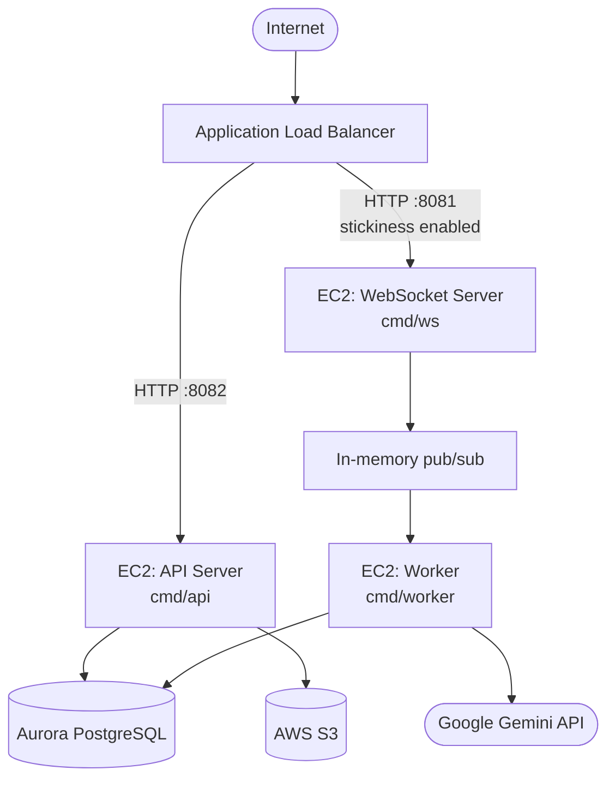

This guide covers deploying CampusHub to AWS for production. The recommended setup uses EC2 instances behind an Application Load Balancer (ALB), Aurora PostgreSQL for the database, and S3 for file storage.

## Architecture overview



**Traffic flow:**
- The ALB terminates HTTPS (port 443) using an ACM certificate and forwards requests to EC2 instances over HTTP.
- The API server and WebSocket server run as separate processes (or on separate instances) on different ports.
- The Worker process has no HTTP port — it communicates with the WebSocket server through an in-memory pub/sub bus. Both must run on the same host unless you upgrade to Redis.

<Warning>
  The current pub/sub implementation is **in-memory** using Go channels. This means the WebSocket server and Worker **must run on the same EC2 instance**. If you scale horizontally to multiple instances, WebSocket messages will not be routed correctly. Upgrade the pub/sub bus to Redis or NATS before running multiple Worker instances. See [Scaling considerations](#scaling-considerations) below.
</Warning>

## Prerequisites

- An AWS account with permissions for EC2, RDS, S3, ALB, ACM, and IAM
- EC2 instances running Amazon Linux 2 or Ubuntu 22.04 — `t3.small` minimum; `t3.medium` recommended
- An RDS Aurora PostgreSQL cluster (or RDS PostgreSQL)
- An S3 bucket for file uploads
- A registered domain and an ACM certificate for HTTPS
- Go 1.21+ installed on EC2 instances

## Deployment steps

<Steps>
  <Step title="Provision Aurora PostgreSQL">
    Create an Aurora PostgreSQL cluster in the same VPC as your EC2 instances:

    - **Engine**: Aurora PostgreSQL-Compatible
    - **Instance class**: `db.t3.medium` or larger
    - **Database name**: `campus`
    - **Port**: `5432`
    - **VPC**: Same VPC as your EC2 instances
    - **Publicly accessible**: No (access via EC2 only)

    After the cluster is provisioned, note the **Writer endpoint** — you will use it in `DB_DSN`.

    Run migrations against the Aurora cluster from an EC2 instance that has `psql` installed:

    ```bash
    cat backend/migrations/*.sql | psql \
      "postgres://postgres:<password>@<aurora-writer-endpoint>:5432/campus?sslmode=require" \
      -v ON_ERROR_STOP=1 -f -
    ```
  </Step>

  <Step title="Create the S3 bucket">
    Create an S3 bucket for file uploads:

    ```bash
    aws s3api create-bucket \
      --bucket campushub-uploads-prod \
      --region us-east-1
    ```

    Block all public access and rely on presigned URLs for client uploads. Attach an IAM policy to your EC2 instance role granting `s3:PutObject`, `s3:GetObject`, and `s3:DeleteObject` on the bucket.

    Example IAM policy:

    ```json
    {
      "Version": "2012-10-17",
      "Statement": [
        {
          "Effect": "Allow",
          "Action": ["s3:PutObject", "s3:GetObject", "s3:DeleteObject"],
          "Resource": "arn:aws:s3:::campushub-uploads-prod/*"
        }
      ]
    }
    ```
  </Step>

  <Step title="Configure EC2 instances">
    Install Go on each EC2 instance:

    ```bash
    # Amazon Linux 2 / Amazon Linux 2023
    sudo yum install -y golang

    # Ubuntu 22.04
    sudo apt-get update && sudo apt-get install -y golang-go
    ```

    Confirm the version:

    ```bash
    go version
    # go version go1.21.x linux/amd64
    ```

    Clone the repository on the instance:

    ```bash
    git clone https://github.com/gopinathsjsu/team-project-cmpe202-03-fall2025-campushub.git
    cd team-project-cmpe202-03-fall2025-campushub
    ```
  </Step>

  <Step title="Build the backend binaries">
    Compile all three backend binaries from the repository root:

    ```bash
    cd backend

    go build -o bin/api ./cmd/api
    go build -o bin/ws  ./cmd/ws
    go build -o bin/worker ./cmd/worker
    ```

    The resulting binaries are statically linked and have no runtime dependencies beyond the OS. Copy them to your deployment location:

    ```bash
    sudo cp bin/api    /usr/local/bin/campushub-api
    sudo cp bin/ws     /usr/local/bin/campushub-ws
    sudo cp bin/worker /usr/local/bin/campushub-worker
    ```
  </Step>

  <Step title="Set production environment variables">
    Create `/etc/campushub/env` on each EC2 instance with production values:

    ```env
    ENV=prod
    PORT=8082
    WS_PORT=8081
    DB_DSN=postgres://postgres:<password>@<aurora-writer-endpoint>:5432/campus?sslmode=require
    JWT_SECRET=<strong-random-secret-min-32-chars>
    GEMINI_API_KEY=<your-gemini-api-key>
    S3_BUCKET=campushub-uploads-prod
    S3_REGION=us-east-1
    S3_PATH_STYLE=false
    PRESIGN_EXPIRY=15
    ```

    Key differences from local development:

    | Variable | Local (dev) | Production |
    |----------|-------------|------------|
    | `ENV` | `dev` | `prod` |
    | `DB_DSN` | `localhost:5434` | Aurora writer endpoint, port `5432` |
    | `S3_ENDPOINT` | `http://localhost:9000` | Omit (use AWS default) |
    | `S3_PATH_STYLE` | `true` | `false` |
    | `JWT_SECRET` | Any dev string | Strong random value |

    <Warning>
      Do not set `S3_ENDPOINT` when using AWS S3. The AWS SDK resolves the correct regional endpoint automatically. Setting it to a MinIO address in production will break all file uploads.
    </Warning>

    Restrict file permissions:

    ```bash
    sudo chmod 600 /etc/campushub/env
    sudo chown root:root /etc/campushub/env
    ```
  </Step>

  <Step title="Create systemd service units">
    Create a systemd unit for each process so they start automatically and restart on failure.

    <CodeGroup>

    ```ini /etc/systemd/system/campushub-api.service
    [Unit]
    Description=CampusHub API Server
    After=network.target

    [Service]
    EnvironmentFile=/etc/campushub/env
    ExecStart=/usr/local/bin/campushub-api
    Restart=always
    RestartSec=5
    User=campushub

    [Install]
    WantedBy=multi-user.target
    ```

    ```ini /etc/systemd/system/campushub-ws.service
    [Unit]
    Description=CampusHub WebSocket Server
    After=network.target campushub-api.service

    [Service]
    EnvironmentFile=/etc/campushub/env
    ExecStart=/usr/local/bin/campushub-ws
    Restart=always
    RestartSec=5
    User=campushub

    [Install]
    WantedBy=multi-user.target
    ```

    ```ini /etc/systemd/system/campushub-worker.service
    [Unit]
    Description=CampusHub Agent Worker
    After=network.target campushub-ws.service

    [Service]
    EnvironmentFile=/etc/campushub/env
    ExecStart=/usr/local/bin/campushub-worker
    Restart=always
    RestartSec=5
    User=campushub

    [Install]
    WantedBy=multi-user.target
    ```

    </CodeGroup>

    Enable and start all services:

    ```bash
    sudo systemctl daemon-reload
    sudo systemctl enable campushub-api campushub-ws campushub-worker
    sudo systemctl start  campushub-api campushub-ws campushub-worker
    ```

    Check service status:

    ```bash
    sudo systemctl status campushub-api
    sudo journalctl -u campushub-api -f
    ```
  </Step>

  <Step title="Configure EC2 security groups">
    Apply these security group rules:

    **EC2 instance security group (inbound):**

    | Port | Protocol | Source | Purpose |
    |------|----------|--------|---------|
    | 8082 | TCP | ALB security group | API server |
    | 8081 | TCP | ALB security group | WebSocket server |
    | 22   | TCP | Your IP only | SSH access |

    Do not expose ports 8082 or 8081 directly to the internet. All traffic must flow through the ALB.

    **ALB security group (inbound):**

    | Port | Protocol | Source | Purpose |
    |------|----------|--------|---------|
    | 443  | TCP | 0.0.0.0/0 | HTTPS |
    | 80   | TCP | 0.0.0.0/0 | HTTP (redirect to HTTPS) |
  </Step>

  <Step title="Configure the Application Load Balancer">
    Create two target groups and one ALB.

    **Target group: API**
    - Protocol: HTTP, Port: 8082
    - Health check path: `/healthz`
    - Stickiness: not required

    **Target group: WebSocket**
    - Protocol: HTTP, Port: 8081
    - Health check path: `/health`
    - **Stickiness: enabled** (required for persistent WebSocket connections)
    - Stickiness duration: 1 day

    **ALB listeners:**

    | Listener | Action |
    |----------|--------|
    | HTTP :80 | Redirect to HTTPS :443 (301) |
    | HTTPS :443 | Forward `/ws` and `/ws/*` to WebSocket target group; all other paths to API target group |

    ALB listener rules for HTTPS (in priority order):

    1. **Rule 1** — Condition: path is `/ws` or `/ws/*` → forward to WebSocket target group
    2. **Default rule** — forward to API target group

    **WebSocket-specific ALB settings:**

    WebSocket connections use HTTP Upgrade. The ALB supports this natively for HTTP/1.1 targets — no additional configuration is required beyond enabling stickiness on the WebSocket target group.

    Attach your ACM certificate to the HTTPS listener.
  </Step>
</Steps>

## HTTPS and SSL

Use AWS Certificate Manager (ACM) to provision a certificate for your domain. ACM certificates are free and auto-renewed.

```bash
# Request a certificate (must be in us-east-1 for CloudFront, or the same region as your ALB)
aws acm request-certificate \
  --domain-name api.campushub.example.com \
  --validation-method DNS \
  --region us-east-1
```

Complete DNS validation by adding the CNAME record that ACM provides to your DNS provider. Once validated, attach the certificate to the ALB HTTPS listener.

## Frontend deployment

The React frontend is a static single-page application. Build and deploy it to S3 + CloudFront or any static hosting service:

```bash
cd frontend

# Set production environment variables before building
VITE_API_URL=https://api.campushub.example.com/v1 \
VITE_WS_URL=wss://api.campushub.example.com \
npm run build
```

The `dist/` directory contains the built assets. Upload to S3 and configure CloudFront to serve the SPA with a fallback to `index.html` for all routes.

## Production health checks

Verify the deployment is healthy:

```bash
# API server
curl https://api.campushub.example.com/healthz

# WebSocket server (check via ALB)
curl https://api.campushub.example.com/ws/health
```

## Scaling considerations

The current architecture is designed for single-instance deployment of the WebSocket server and Worker. To scale horizontally, the in-memory pub/sub bus must be replaced with an external message broker.

**Current limitation:** The WebSocket server (`cmd/ws`) and Worker (`cmd/worker`) share an in-memory Go channel bus. Both processes must run on the same OS process — which they do not; they are separate binaries. This means the WebSocket server and Worker must run on the **same EC2 instance** to communicate.

**Recommended upgrade path for multi-instance scaling:**

```
Replace: internal/pubsub (in-memory channels)
With:    Redis Pub/Sub or NATS JetStream

Update:  cmd/ws  → subscribe/publish via Redis
Update:  cmd/worker → subscribe/publish via Redis
Keep:    same topic names (agent.request, agent.response)
```

Once the pub/sub bus is backed by Redis, you can run multiple Worker instances behind a single Redis cluster, and multiple WebSocket server instances behind the ALB with stickiness. ALB stickiness ensures each connected client's messages are always handled by the same WebSocket server instance, while workers process jobs from the shared Redis queue.

<Note>
  The API server (`cmd/api`) is stateless and can be scaled to multiple instances behind the ALB without any changes. Only the WebSocket server and Worker require the pub/sub upgrade before horizontal scaling.
</Note>
